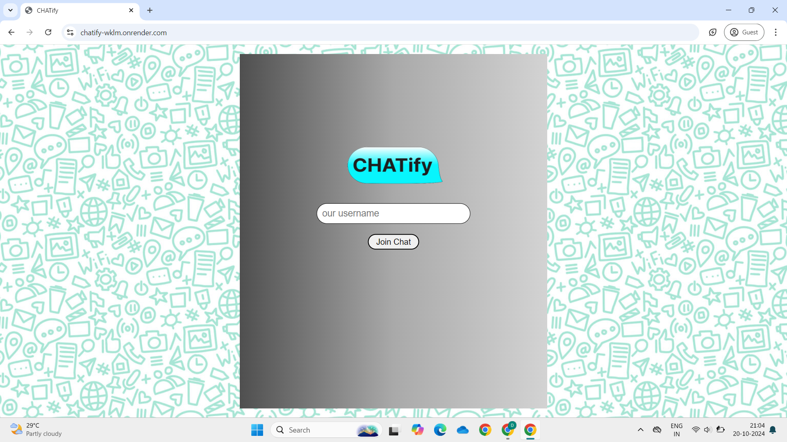
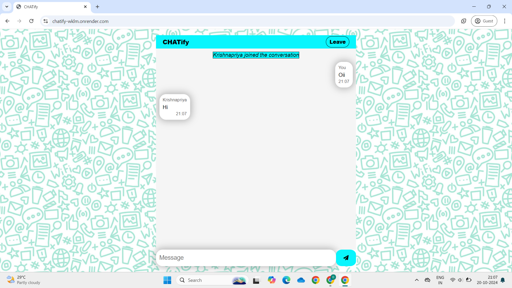

<h1>CHATify</h1>

Welcome to the CHATify - a dynamic chatting interface

Features :
--------
* **Room Creation & Management**: Users can create and join chat rooms by entering a unique room name. Each room maintains a separate chat space, ensuring private and organized conversations.
* **See Who is in the Room**: Users can view the list of all active members in the room at any time. A scrollable member list allows users to check who is currently online.
* **Multi-User Live Collaboration**: Allow multiple users to join and chat in real-time, fostering dynamic conversations. Messages appear instantly, creating a fluid, interactive experience for group discussions.
* **Exit-Triggered Chat Deletion**: Enable automatic deletion of chats once users exit, ensuring that no data is stored after the session, maintaining user confidentiality and reducing storage overhead.
* **Responsive Design**: Accessible on various devices, including desktops, tablets, and smartphones.
  
Screenshots :
-----------

  
  

Getting Started :
---------------
### Prerequisites

To run the CHATify locally or contribute to its development, you’ll need:

* **Node.js** : [Download and install Node.js](https://nodejs.org/)
* **Git** : [Download and install Git](https://git-scm.com/)

Installation :
------------
Clone the repository and install dependencies :

    git clone https://github.com/krish2213/chatify.git
    cd chatify
    npm install
        

Running the Application :
-----------------------
To start the application locally

    npm start
    
This will start the development server, and you can access the CHATify locally by navigating to [http://localhost:3000](http://localhost:3000) in your web browser.

Live Demo :
-----------------------
  [https://chatify.azurewebsites.net/](https://chatify.azurewebsites.net/)

Usage :
-----
### Logging in and Chatting

1.  Login with your respective username.
2.  Chat with other users in real-time.
3.  Messages are visible only while users are active.
4.  Leave the chat when you're done.
5.  Experience disappearing chats

Contributing :
------------
I welcome contributions! Please follow these steps to contribute :
1.  Fork the repository.
2.  Create a new branch for your feature or bugfix.
3.  Commit your changes and push them to your fork.
4.  Submit a pull request to the main repository.

License :
-------
This project is licensed under the MIT License - see the [LICENSE](LICENSE) file for details.
  
&copy; Krishnapriya K
